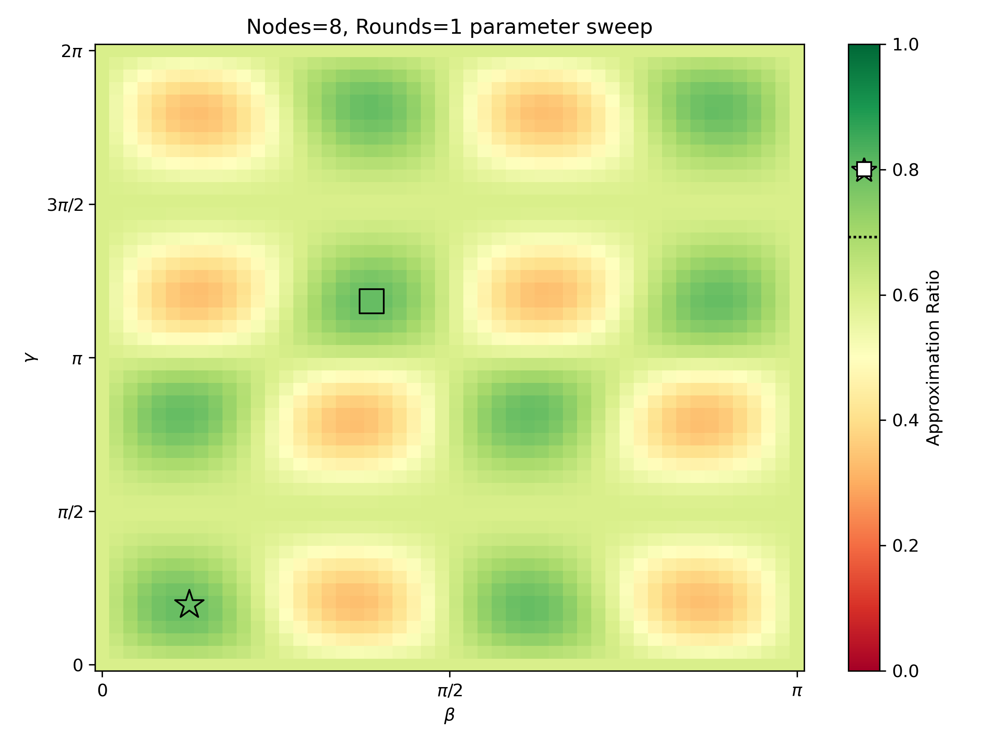

# QED-C Tests of the QAOA Fixed Angle Conjecture

This repository contains the simplest possible code that executes the same QAOA algorithm used in the QED-C Max-Cut benchmark.  This example code is designed to highlight the disrepancy between the results obtained with this QAOA implementation and the results presented in the Fixed Angle Conjecture paper.

`Qiskit` and `numpy` packages are required to run code in this repository. The (unweighted) graphs used for solving the MaxCut problem are stored under `problemLibrary/instances`. For each graph size and degree a particular instance has been chosen, and the nodes and edges are specified in a text file. For example, the file corresponding to a graph with 4 nodes which is 3-regular is `problemLibrary/instances/mc_004_003_000.txt', while the optimal cut size and cut are specified in `problemLibrary/instances/mc_004_003_000.sol'. The edges, nodes and MaxCut solution can be read from functions specified in `problemLibrary/common.py`.  The cut size corresponding to a cut can be computed using the `eval_cut` function within this file. The fixed angles are stored in `problemLibrary/angles_regular_graphs.json`, which has been copied from https://github.com/danlkv/fixed-angle-QAOA

The implementation can be found in `fixed-angles.ipynb`. The first two cells define functions for evaluating the approximation ratio for a chosen graph size and degree. The next two cells compute and plot the approximation ratio for various sizes and fixed value of QAOA rounds. Shown below are the approximation ratios obtained at the fixed angles for rounds=1.

The next two code cells compute the approximation ratios for a grid of $\beta,\gamma$ values within the range of values for rounds=1. The landscape is plotted, and the best angles obtained (fixed angles) are shown by a square (star). Shown below is the approximation ratio landscape obtained for a size 8 graph with a 1 round QAOA.

<!--- #  ---!>
